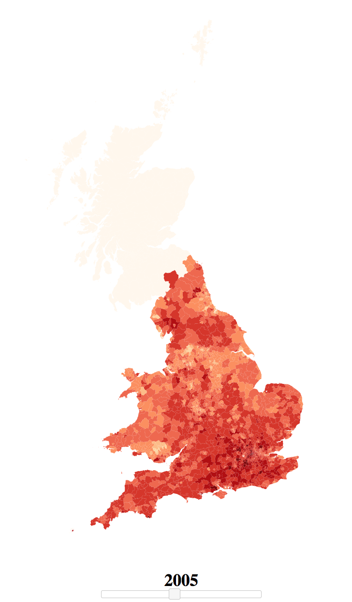

# MAYA

Current Project
## HOUSE PRICES IN THE UK

### To run locally
Go to the `frontend` folder and run `npm install` followed by `npm start`.

The data processing is done in the `housing` folder (python files and ipython notebooks). `frontend` has all of the D3 related content for actually displaying the map.

### Next To Do:
- Scale and zoom - transition between levels [DONE]
    - when transitioning between levels keep the outer level there, stroke only
    - pre-load the transition so we don't get a discontinuous jump
- map overlays (so we know which area / county we are in)
- filter data by house size, detached etc.
- fix errors/holes in the data
- option to adjust for inflation
- option to display geograpic information (e.g. label big cities, major areas and roads)
- make map screen sized
- figure out why london districts are smaller e.g WC1F rather than WC1 (must be something to do with the geometry data)

What it currently looks like:
