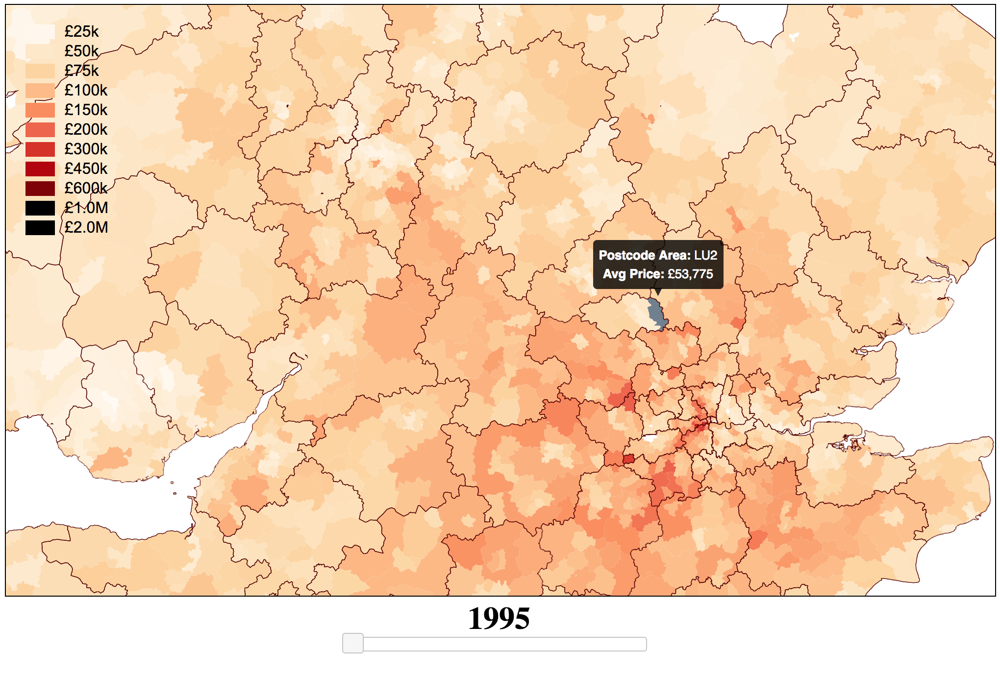

# MAYA

Current Project
## HOUSE PRICES IN THE UK

### View the live demo of this project at
[https://ahussain3.github.io/maya/](https://ahussain3.github.io/maya/)

### To run locally
Go to the `frontend` folder and run `npm install` followed by `npm start`.

The data processing is done in the `housing` folder (python files and ipython notebooks). `frontend` has all of the D3 related content for actually displaying the map.

### Next To Do:
- Replace GeoJSON geometry with TOPOJson (use openstreetmap data instead)
- option to adjust for inflation
- option to display geograpic information (e.g. label big cities, major areas and roads)
- compare house price data against average incomes for the same period

What it currently looks like:
